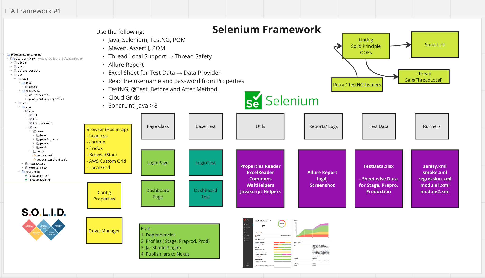

Selenium Automation Framework(with Java)

* Author - Siddesh Godkar

* Java, Selenium, TestNG

* Maven, AssertJ, POM

* Thread Local Support → Thread Safety

* Allure Report
 
* Excel Sheet for Test Data → Data Provider, Apache POI
 
* Read the username and password from Properties-
 
* TestNG, @Test, Before and After Method.
 
* Cloud Grids - BrowserStack, LambdaTest
 
* SonarLint, Java > 22
 
* Run Local and on Selenoid Integration.

